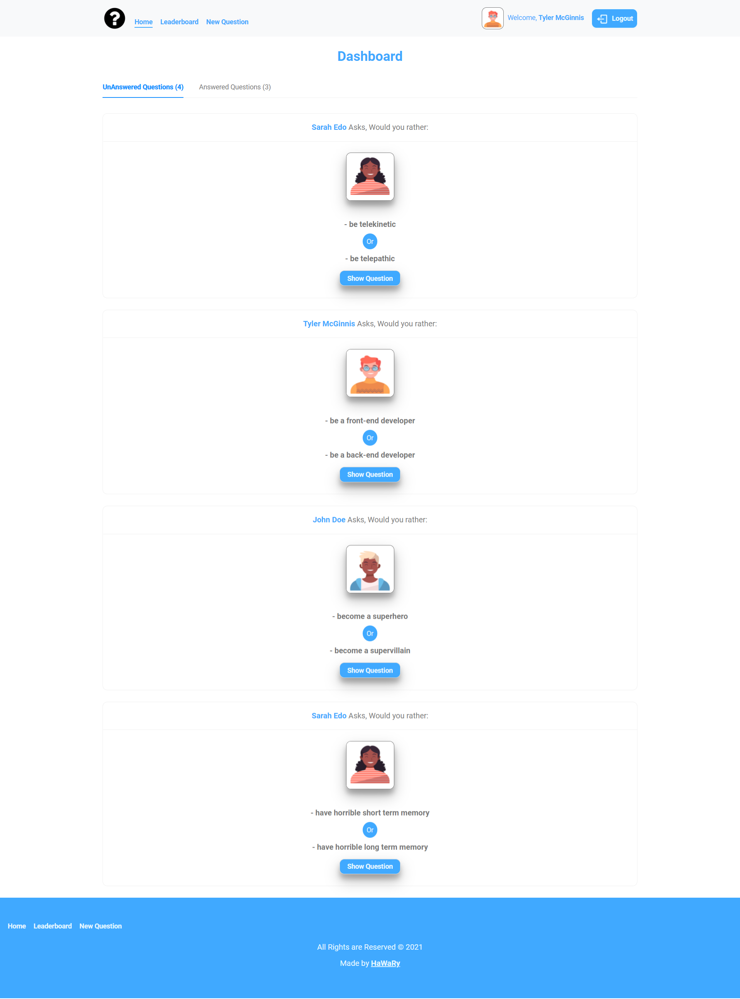

# Would You Rather

[](https://app.netlify.com/sites/would-you-rather14/deploys)

Would You Rather is a Questionnaire App that allows you to ask and answer Questions about what you rather between only two options, it allows you to answer your own question or any other user's question, add and ask a new question to the other users, also you can access the leaderboard page to see the active state of the users according to their score.

 
## Demo

https://user-images.githubusercontent.com/69651552/132402671-b64aaefb-b3e6-4f15-9af2-4f3111c0cadc.mp4

## Instructions, Building & Getting Started  
    - 1- Fork, clone or download this repository to your local machine.
    - 2- Be sure that you install the [Node.js](https://nodejs.org/en/) environment in your machine.
    - 3- Open your terminal and Be sure that you are inside the correct destination of the App, while you must be in the same path of the package.json file and the website folder.
    - 4- inside your terminal run these commands:-
    
        * to install dependencies.
        ```
        npm install
        ```
        * to start the server.
        ```
        npm start
        ```
    - 5- Once the app server is running visit (localhost:3000) in the browser to view the app and now you can treat with it as shown above in the Demo.

    - 6- You can also see a live preview of the app from this Link (https://would-you-rather14.netlify.app/)

## Pages

* Login
* Dashboard
* Leaderboard
* New Question
* Question
* 404
## Built With

* HTML
* CSS
* JS

## Libraries & Packages

* [Redux](https://redux.js.org/)
* [React Redux](https://react-redux.js.org/)
* [React Icons](https://react-icons.github.io/react-icons/)
* [Redux Thunk](https://www.npmjs.com/package/redux-thunk)
* [React Router](https://www.npmjs.com/package/react-router)
* [React Router Dom](https://www.npmjs.com/package/react-router-dom)

## Frameworks 

* [React.js](https://reactjs.org/)  
* [Antdesign](https://ant.design/)
* [React Bootstrap](https://react-bootstrap.github.io/)
## Author

* Mohamed Elhawary  

## Contact Me by my Social Accounts

* Email: mohamed.k.elhawary@gmail.com  

* [Linkedin](https://www.linkedin.com/in/mohamed-elhawary14/)

* [Codepen](https://codepen.io/Mohamed-ElHawary)

* [Behance](https://www.behance.net/mohamed-elhawary14)

## Deploy with Me

Feel Free to Deploy it with me, send Issues or a Pull Request and i'll deal with you, just test it First.

## Notices & Overview about the App

- This Application is a Practical Project from Udacity Nanodegree Program in the Field of Web Development Advanced Track.

- The App depends on a fake static database, using customized methods to make requests which deal with this fake static database.

- You have the ability to login with 3 optional users in the login form, and you have to choose at least one user to can access the internal pages of the app.

- The App contains 404 page which will be rendered if the user access not available page.

- Due to dealing with fake static database, so if you try to reload the App at any time, your progrees in the App about adding or answering questions will be lost, and the data will be reset to its initial state.

- The `_DATA.js` file represents the fake static database and methods that let you access this data.

- There are two types of objects stored in the fake static database: [Questions & Users]

- Your code will talk to the database via 4 methods:
    * `_getUsers()`
    * `_getQuestions()`
    * `_saveQuestion(question)`
    * `_saveQuestionAnswer(object)`
    ---------------------------------------------------

    1) `_getUsers()` Method:
    *Description*: Get all of the existing users from the database.  
    *Return Value*: Object where the key is the user’s id and the value is the user object.

    2) `_getQuestions()` Method:
    *Description*: Get all of the existing questions from the database.  
    *Return Value*: Object where the key is the question’s id and the value is the question object.

    3) `_saveQuestion(question)` Method:
    *Description*: Save the polling question in the database.  
    *Parameters*:  Object that includes the following properties: `author`, `optionOneText`, and `optionTwoText`.
    *Return Value*:  An object that has the following properties: `id`, `author`, `optionOne`, `optionTwo`, `timestamp`.

    4) `_saveQuestionAnswer(object)` Method:
    *Description*: Save the answer to a particular polling question in the database.
    *Parameters*: Object that contains the following properties: `authedUser`, `qid`, and `answer`.

- Finally, you can take this App as a reference and strong practical & revision to understand the working logic of `redux`, `react-redux` & middlware like `redux-thunk` and how they inteact with a react App.
## License

Licensed under the [MIT License](LICENSE)